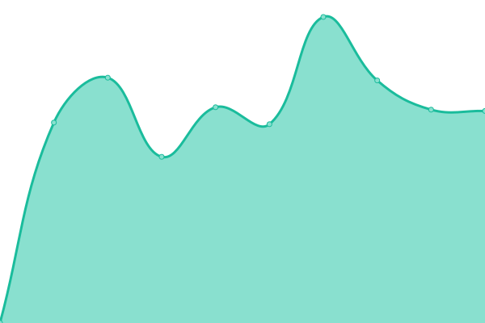

# [📈 Live Status](https://uptime.lawcloud.page): <!--live status--> **🟧 Partial outage**

This repository contains the open-source uptime monitor and status page for [Upptime](https://upptime.js.org), powered by [Upptime](https://github.com/upptime/upptime).

With [Upptime](https://upptime.js.org), you can get your own unlimited and free uptime monitor and status page, powered entirely by a GitHub repository. We use [Issues](https://github.com/upptime/upptime/issues) as incident reports, [Actions](https://github.com/TheBlankness/uptime-lawcloud/actions) as uptime monitors, and [Pages](https://lawcloud.page) for the status page.

<!--start: status pages-->
<!-- This summary is generated by Upptime (https://github.com/upptime/upptime) -->
<!-- Do not edit this manually, your changes will be overwritten -->
<!-- prettier-ignore -->
| URL | Status | History | Response Time | Uptime |
| --- | ------ | ------- | ------------- | ------ |
|  [Uptime Kuma](status.lawcloud.page) | 🟥 Down | [uptime-kuma.yml](https://github.com/TheBlankness/uptime-lawcloud/commits/HEAD/history/uptime-kuma.yml) | 

 1965ms
     
 | 

<a href="https://uptime.lawcloud.page/history/uptime-kuma">99.30%</a>
    

|  [LawDrive Cloud](lawdrive.lawcloud.page) | 🟥 Down | [law-drive-cloud.yml](https://github.com/TheBlankness/uptime-lawcloud/commits/HEAD/history/law-drive-cloud.yml) | 

 2046ms
     
 | 

<a href="https://uptime.lawcloud.page/history/law-drive-cloud">99.34%</a>
    

|  [Truenas WebUI](truenas.lawcloud.page) | 🟥 Down | [truenas-web-ui.yml](https://github.com/TheBlankness/uptime-lawcloud/commits/HEAD/history/truenas-web-ui.yml) | 

 2124ms
     
 | 

<a href="https://uptime.lawcloud.page/history/truenas-web-ui">99.08%</a>
    

|  [Doujin Server](doujin-server.lawcloud.page) | 🟩 Up | [doujin-server.yml](https://github.com/TheBlankness/uptime-lawcloud/commits/HEAD/history/doujin-server.yml) | 

 1556ms
     
 | 

<a href="https://uptime.lawcloud.page/history/doujin-server">94.15%</a>
    

|  [Law Blog](blog.lawcloud.page) | 🟩 Up | [law-blog.yml](https://github.com/TheBlankness/uptime-lawcloud/commits/HEAD/history/law-blog.yml) | 

 1748ms
     
 | 

<a href="https://uptime.lawcloud.page/history/law-blog">98.34%</a>
    

<!--end: status pages-->

[**Visit our status website →**](https://lawcloud.page)

## 📄 License

- Powered by: [Upptime](https://github.com/upptime/upptime)
- Code: [MIT](./LICENSE) © [Upptime](https://upptime.js.org)
- Data in the `./history` directory: [Open Database License](https://opendatacommons.org/licenses/odbl/1-0/)
