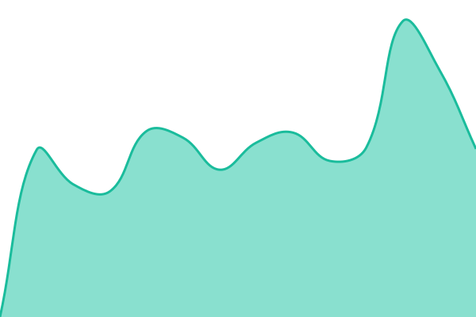
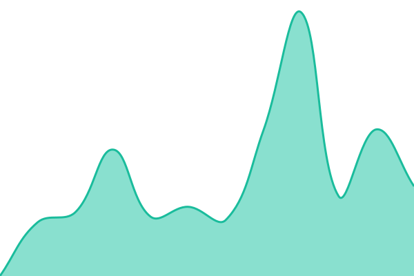
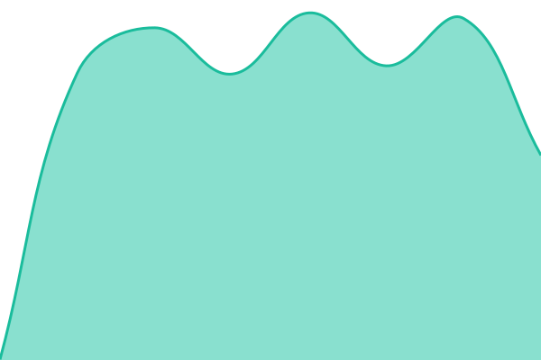
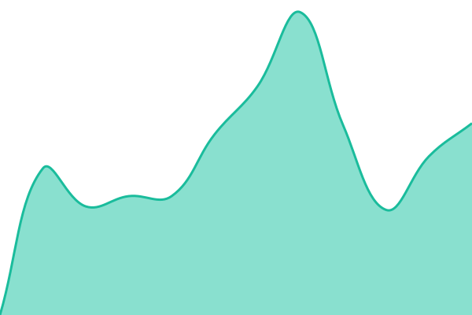

# [📈 Live Status](https://uptime.jomcloud.com): <!--live status--> **🟩 All systems operational**

This repository contains the open-source uptime monitor and status page for [Upptime](https://upptime.js.org), powered by [Upptime](https://github.com/upptime/upptime).

With [Upptime](https://upptime.js.org), you can get your own unlimited and free uptime monitor and status page, powered entirely by a GitHub repository. We use [Issues](https://github.com/upptime/upptime/issues) as incident reports, [Actions](https://github.com/TheBlankness/uptime-lawcloud/actions) as uptime monitors, and [Pages](https://uptime.jomcloud.com) for the status page.

<!--start: status pages-->
<!-- This summary is generated by Upptime (https://github.com/upptime/upptime) -->
<!-- Do not edit this manually, your changes will be overwritten -->
<!-- prettier-ignore -->
| URL | Status | History | Response Time | Uptime |
| --- | ------ | ------- | ------------- | ------ |
|  [LawCloud Network](www.jomcloud.com) | 🟩 Up | [law-cloud-network.yml](https://github.com/TheBlankness/uptime-lawcloud/commits/HEAD/history/law-cloud-network.yml) | 

 977ms
     
 | 

<a href="https://uptime.jomcloud.com/history/law-cloud-network">100.00%</a>
    

|  [Portainer](portainer.jomcloud.com) | 🟩 Up | [portainer.yml](https://github.com/TheBlankness/uptime-lawcloud/commits/HEAD/history/portainer.yml) | 

 800ms
     
 | 

<a href="https://uptime.jomcloud.com/history/portainer">100.00%</a>
    

|  [Image Cloud](photos.jomcloud.com) | 🟩 Up | [image-cloud.yml](https://github.com/TheBlankness/uptime-lawcloud/commits/HEAD/history/image-cloud.yml) | 

 1454ms
     
 | 

<a href="https://uptime.jomcloud.com/history/image-cloud">100.00%</a>
    

|  [Truenas WebUI](truenas.jomcloud.com) | 🟩 Up | [truenas-web-ui.yml](https://github.com/TheBlankness/uptime-lawcloud/commits/HEAD/history/truenas-web-ui.yml) | 

 1166ms
     
 | 

<a href="https://uptime.jomcloud.com/history/truenas-web-ui">100.00%</a>
    

|  [Manga Server](manga.jomcloud.com) | 🟩 Up | [manga-server.yml](https://github.com/TheBlankness/uptime-lawcloud/commits/HEAD/history/manga-server.yml) | 

 630ms
     
 | 

<a href="https://uptime.jomcloud.com/history/manga-server">100.00%</a>
    

|  [Crafty Controller](crafty.jomcloud.com) | 🟩 Up | [crafty-controller.yml](https://github.com/TheBlankness/uptime-lawcloud/commits/HEAD/history/crafty-controller.yml) | 

 1674ms
     
 | 

<a href="https://uptime.jomcloud.com/history/crafty-controller">100.00%</a>
    

|  [Hazim Portfolio](hazim.jomcloud.com) | 🟩 Up | [hazim-portfolio.yml](https://github.com/TheBlankness/uptime-lawcloud/commits/HEAD/history/hazim-portfolio.yml) | 

 1413ms
     
 | 

<a href="https://uptime.jomcloud.com/history/hazim-portfolio">100.00%</a>
    

<!--end: status pages-->

[**Visit our status website →**](https://uptime.jomcloud.com)

## 📄 License

- Powered by: [Upptime](https://github.com/upptime/upptime)
- Code: [MIT](./LICENSE) © [Upptime](https://upptime.js.org)
- Data in the `./history` directory: [Open Database License](https://opendatacommons.org/licenses/odbl/1-0/)
